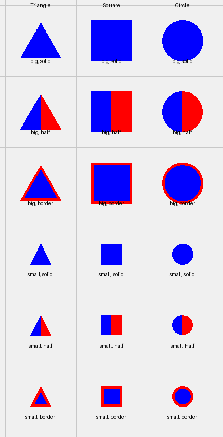

# Synthetic Visual Data for Referring Expressions

Generate synthetic images with geometric shapes and annotations for referring expression tasks.

## Features

- Various shapes (triangle, square, circle)
- Shape properties (size, color, style, rotation)
- Organized grid layouts with random region placement
- Minimum spacing between objects (1/4 of smaller object's bbox)
- Proper bounding box calculation for rotated shapes
- Configurable grid sizes (2x2 up to 8x8)
- JSONL format annotations

## Installation

```bash
# Create virtual environment
uv venv .venv
source .venv/bin/activate

# Install dependencies
uv pip install pillow numpy matplotlib tqdm
```

## Quick Start

Generate a gallery of shapes:
```bash
python generate_gallery.py
```

Generate a small dataset with basic grids:
```bash
python generate_samples.py --num-samples 4 --output-dir samples
```

Generate a dataset with larger, complex grids:
```bash
python generate_samples.py --num-samples 20 --output-dir complex_samples --min-grid 4 --max-grid 8
```

Visualize an image with annotations:
```bash
python visualize.py --image samples/images/sample_0000.png --jsonl samples/annotations/dataset.jsonl --show-grid --show-bbox --show-region
```

## Project Structure

- `src/` - Core code for shape generation and scene composition
- `samples/` - Sample image outputs and annotations
- Generation scripts:
  - `generate_samples.py` - Create datasets
  - `generate_gallery.py` - Create shape galleries
- `visualize.py` - Visualization tool
- `MANAGEMENT.md` - Project management guidelines

## Shape Styles

- **Solid**: Single color fill
- **Half**: Two-color split (left/right)
- **Border**: Main color with different border

## Grid Layouts

Objects are arranged in grid layouts with:
- Configurable grid sizes (from 2x2 up to 8x8)
- Random region placement in the image
- Random offsets within each grid cell
- Minimum distance between objects (1/4 of smaller object's bounding box)
- Special handling for rotated shapes to maintain proper spacing

## Examples



## Management

See [MANAGEMENT.md](MANAGEMENT.md) for project guidelines and best practices.